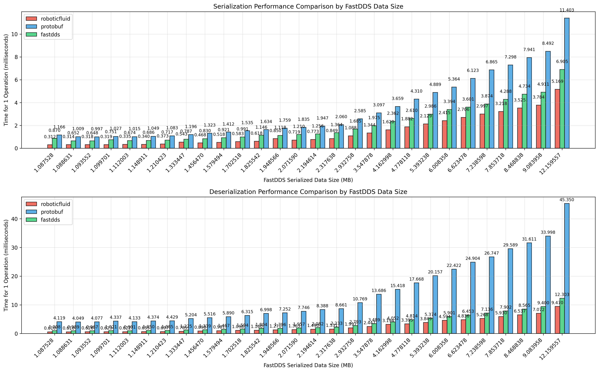

A fast serialization type system and it's compiler. This type system support both C++ and Python API, sharing the same memory underneath, avoiding conversion between C++ and Python. For data persistence, instead of traditional member-wise serialization/deserialization, this type system takes memory dump/load approach, which is intrinsically faster than conventional serialization methods. This is achieved through static memory analysis of data types during compile time and code generation, all by it's compiler. 

- [Architecture](#architecture)
- [Supported Types](#supported-types)
  - [Type Categories](#type-categories)
  - [Key Features](#key-features)
- [Benchmark](#benchmark)

# Architecture

# Supported Types

The roboticfluid type system supports a wide range of data types, from basic primitives to complex custom types, with both fixed-size arrays and dynamic arrays. All types share the same memory layout between C++ and Python, enabling zero-copy data exchange.

## Type Categories

| Category | C++ Type | Python Type | Remark |
|----------|----------|-------------|---------|
| **Basic Types** | | | |
| Integer (32-bit) | `int32_t` | `int` | |
| Integer (64-bit) | `int64_t` | `int` | |
| Unsigned (32-bit) | `uint32_t` | `int` | |
| Unsigned (64-bit) | `uint64_t` | `int` | |
| Float (32-bit) | `float` | `float` | |
| Float (64-bit) | `double` | `float` | |
| Boolean | `bool` | `bool` | |
| String | `std::string` | `bytes` | |
| **Enum Types** | | | |
| Enum | `enum class` | `Enum` | |
| **Custom Types** | | | |
| Custom Class | `class` | `Class` | |
| **Containers** | | | |
| Fixed Array | `std::array<T, N>` | `list[N]` | N can be any basic type, string, enum, uint8_t, or custom type |
| Dynamic Array | `std::vector<T>` | `list[N]` | N can be any basic type, string, enum, uint8_t, or custom type |

## Key Features

- **Zero-copy**: C++ and Python share the same memory layout
- **Memory dump/load**: Fast binary serialization without member-wise operations
- **Type safety**: Compile-time type checking and validation
- **Array support**: Both fixed-size (`std::array`) and dynamic (`std::vector`) arrays
- **Nested types**: Support for complex nested data structures

# Benchmark

*Note: The benchmark source code can be found in the [benchmark](poc/benchmark/) directory.*

**roboticfluid** outperforms **Protobuf** and **FastDDS** in serialization/deserialization:

- **~52% faster** serialization than Protobuf and **~38% faster** than FastDDS
- **~89% faster** deserialization than Protobuf and **~53% faster** than FastDDS
- **Consistent performance advantage** that scales with data size
