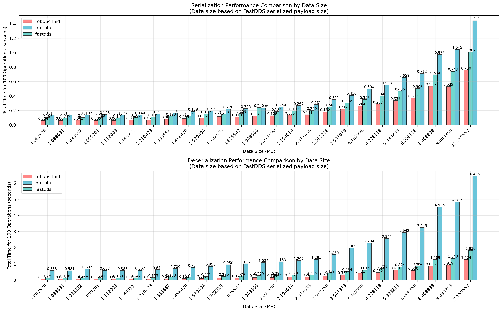

A serialization-free type system and it's compiler. This type system support both C++ and Python API, sharing the same memory underneath, avoiding conversion between C++ and Python. For data persistence, instead of serialization/deserialization, this type system takes memory dump/load approach, which is intrinsically faster than member-wise serialization/deserialization. This is achieved through static memory analysis of data types during compile time and code generation, all by it's compiler. 

- [Architecture](#architecture)
- [Benchmark](#benchmark)

# Architecture

# Benchmark

