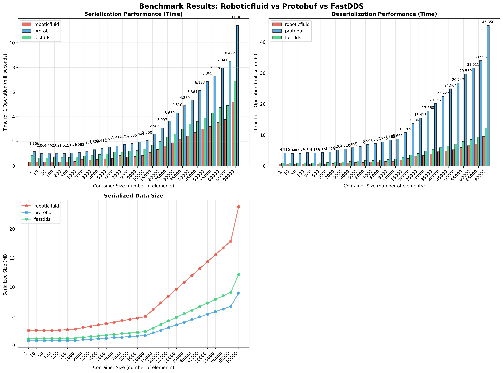

A fast serialization type system and it's compiler. This type system support both C++ and Python API, sharing the same memory underneath, avoiding conversion between C++ and Python. For data persistence, instead of traditional member-wise serialization/deserialization, this type system takes memory dump/load approach, which is intrinsically faster than conventional serialization methods. This is achieved through static memory analysis of data types during compile time and code generation, all by it's compiler. 

- [Key Features](#key-features)
- [Architecture](#architecture)
- [Supported Types](#supported-types)
- [Speed Benchmark](#speed-benchmark)
- [Caveat](#caveat)

# Key Features

- **Same memory/Different languages**: Both C++ and Python API are supported, sharing same data memory layout.
- **Extensive types**: See [Supported Types](#supported-types)
- **Zero-conversion**: Save data in one language and load in another, without conversions.
- **Memory dump/load**: Faster([Benchmark](#speed-benchmark)) binary serialization without member-wise operations.
- **Compression mode**: Compression mode significantly saves disk space for data persistence.
- **Type safety**: Compile-time type checking and validation
- **Memory analysis**: Static data type memory analysis and report.

# Architecture


# Supported Types

The roboticfluid type system supports a wide range of data types, from basic primitives to complex custom types, with both fixed-size arrays and dynamic arrays. All types share the same memory layout between C++ and Python, enabling zero-copy data exchange. The Python API provides type safety through compile-time type checking using pybind11.


| Category | C++ Type | Python Type | Remark |
|----------|----------|-------------|---------|
| **Basic Types** | | | |
| Integer (32-bit) | `int32_t` | `int` | |
| Integer (64-bit) | `int64_t` | `int` | |
| Unsigned (32-bit) | `uint32_t` | `int` | |
| Unsigned (64-bit) | `uint64_t` | `int` | |
| Float (32-bit) | `float` | `float` | |
| Float (64-bit) | `double` | `float` | |
| Boolean | `bool` | `bool` | |
| String | `std::string` | `bytes` | Python bytes equivalent to C++ string (no encoding info) |
| **Enum Types** | | | |
| Enum | `enum class` | `Enum` | |
| **Custom Types** | | | |
| Custom Class | `class` | `Class` | Can contain any other types and be nested |
| **Containers** | | | |
| Fixed Array | `std::array<T, N>` | `list[N]` | N can be any basic type, string, enum, uint8_t, or custom type |
| Dynamic Array | `std::vector<T>` | `list[N]` | N can be any basic type, string, enum, uint8_t, or custom type |


# Speed Benchmark




*Note: The benchmark source code can be found in the [benchmark](poc/benchmark/) directory.*

```
=== ROBOTICFLUID PERFORMANCE ANALYSIS ===

=== AVERAGE PERFORMANCE ACROSS ALL DATA SIZES ===
Roboticfluid Serialization: 1.432375 ms
Roboticfluid Deserialization: 2.628819 ms
Protobuf Serialization: 3.359743 ms
Protobuf Deserialization: 13.707475 ms
FastDDS Serialization: 2.069532 ms
FastDDS Deserialization: 3.599653 ms

=== PERFORMANCE RATIOS (SPEEDUP) ===
Roboticfluid vs Protobuf Serialization: 2.35x faster
Roboticfluid vs FastDDS Serialization: 1.44x faster
Roboticfluid vs Protobuf Deserialization: 5.21x faster
Roboticfluid vs FastDDS Deserialization: 1.37x faster

=== PERFORMANCE SCALING ANALYSIS ===
Serialization Performance by Data Size Range:
  Small (1-100 elements, 1.088-1.100 MB): 0.315818 ms
  Medium (200-2000 elements, 1.112-1.333 MB): 0.397728 ms
  Large (3000-6000 elements, 1.456-1.826 MB): 0.546856 ms
  Very Large (7000-90000 elements, 1.949-12.160 MB): 2.191557 ms

Deserialization Performance by Data Size Range:
  Small (1-100 elements, 1.088-1.100 MB): 0.617142 ms
  Medium (200-2000 elements, 1.112-1.333 MB): 0.689696 ms
  Large (3000-6000 elements, 1.456-1.826 MB): 1.033976 ms
  Very Large (7000-90000 elements, 1.949-12.160 MB): 4.015230 ms

=== COMPRESSION PERFORMANCE ANALYSIS ===
Serialization Compression Overhead: 4.39x slower
  Data size range: 1.088-12.160 MB
  Normal: 1.432375 ms
  Compressed: 6.287033 ms

Deserialization Decompression Overhead: 1.57x slower
  Data size range: 1.088-12.160 MB
  Normal: 2.628819 ms
  Compressed: 4.129084 ms

=== PERFORMANCE SUMMARY ===
Key Findings:
• Roboticfluid serialization is 2.3x faster than Protobuf
• Roboticfluid serialization is 1.4x faster than FastDDS
• Roboticfluid deserialization is 5.2x faster than Protobuf
• Roboticfluid deserialization is 1.4x faster than FastDDS

Performance Characteristics:
• Roboticfluid shows consistent performance advantages across all data sizes
• Compression adds overhead but provides significant size reduction
```

# Caveat

Due to the memory dump approach, the default roboticfluid mode uses significantly more storage space compared to Protobuf and FastDDS, while making roboticfluid more fast. However, with the compression mode of roboticfluid, the storage can be greatly reduced. So the advance for switching between these two mode are:

- Use the normal API without compression to take advantage of the speed of roboticfluid, such as in IPC communication.
- Use the compression API with data compression to take advantage of the storage size, suas as in situations where data need to be persisted.
